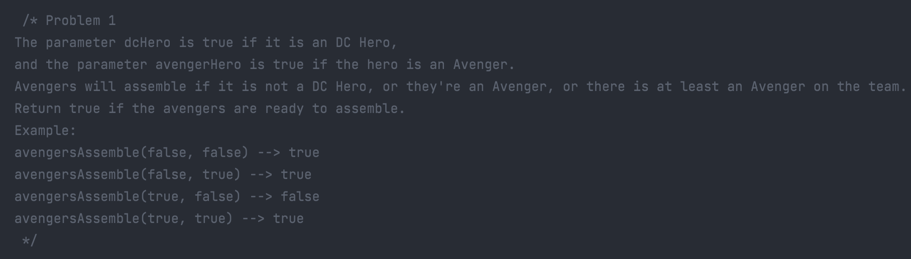
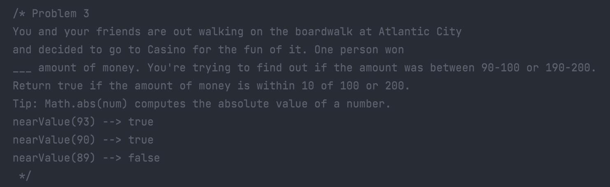
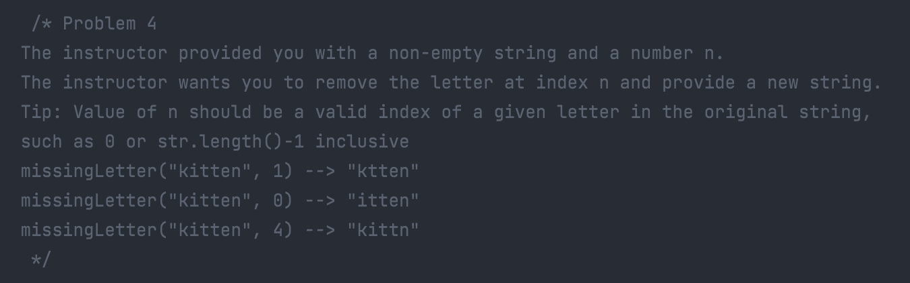
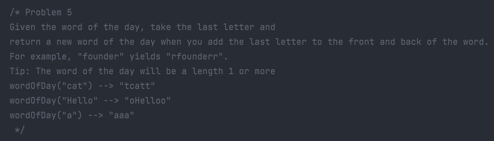
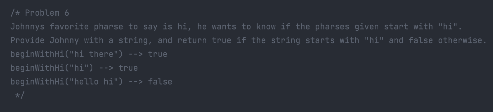
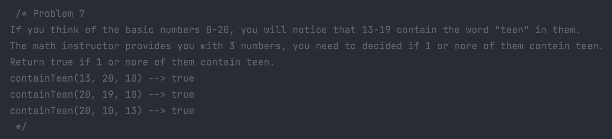
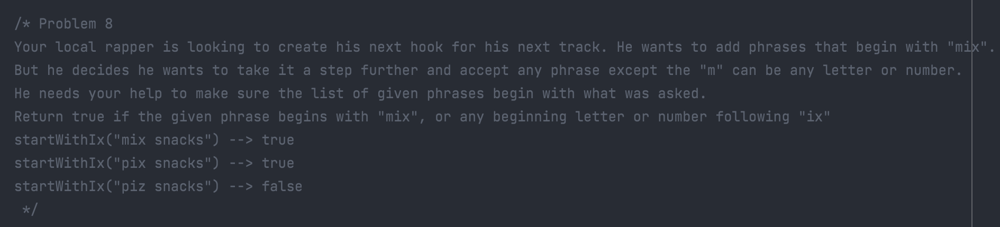
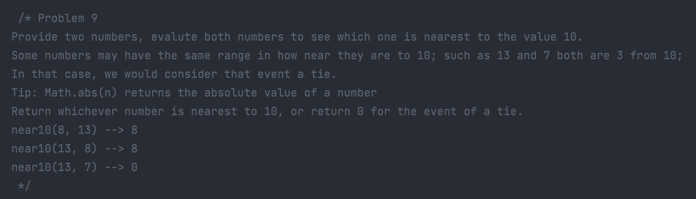
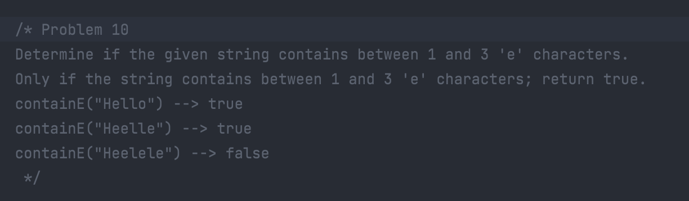

# Problem Set

You will be solving the given problems below.

### Problem 01

### Problem 03

### Problem 04

### Problem 05

### Problem 06

### Problem 07

### Problem 08

### Problem 09

### Problem 10

## Submission

Commit and push your solution to GitHub

